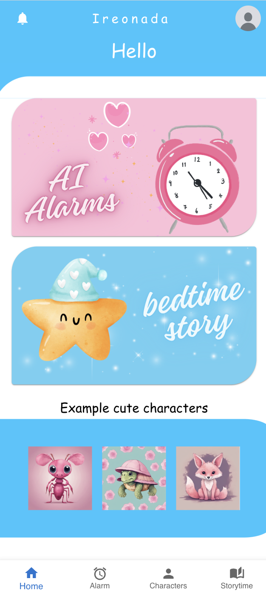
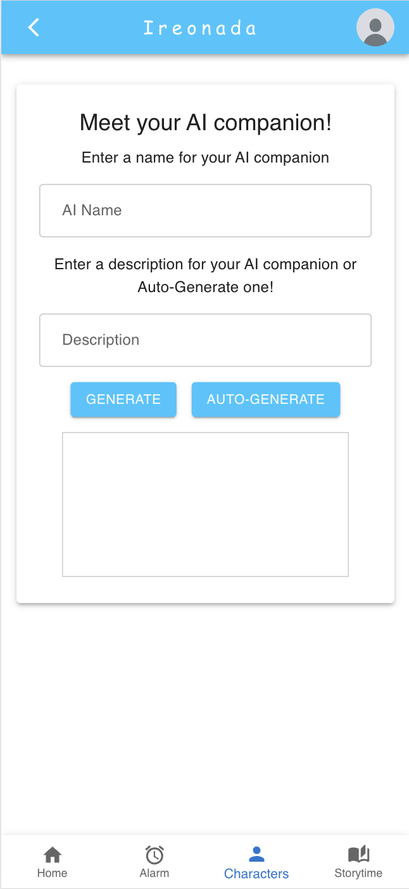
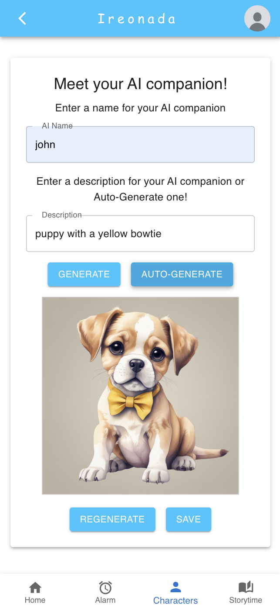
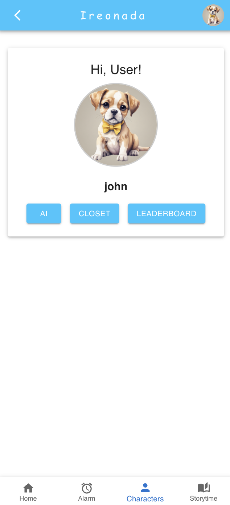
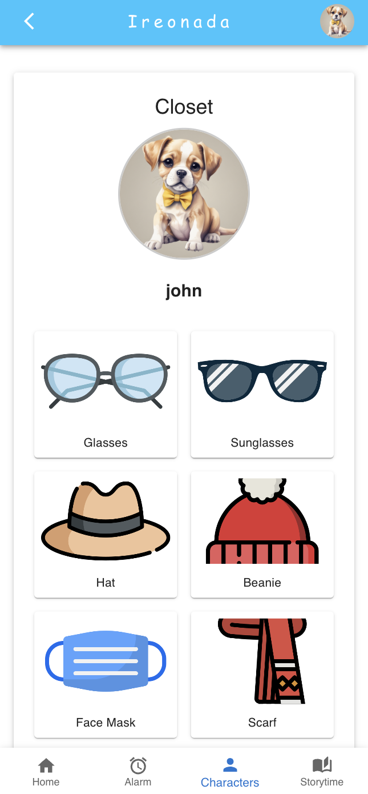
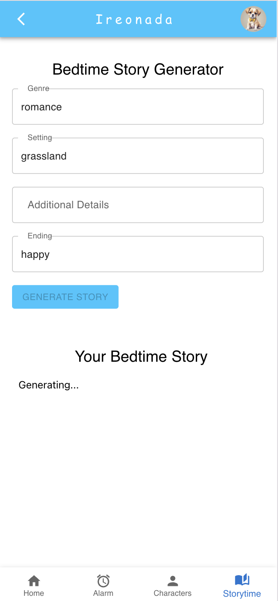
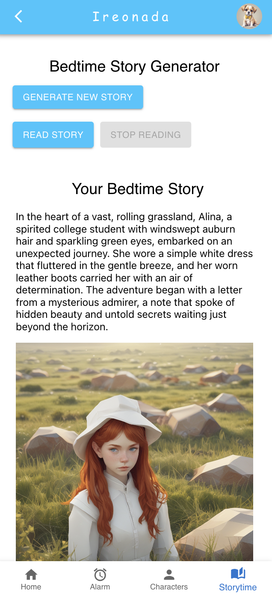
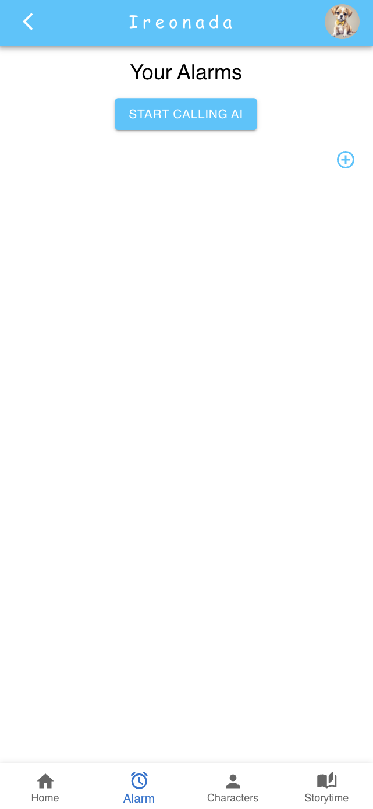
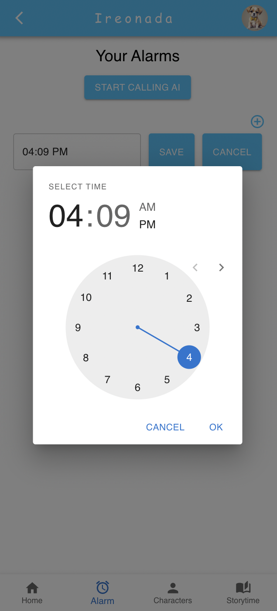
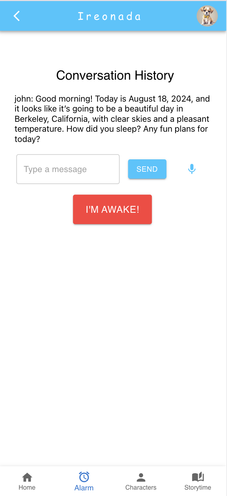

# AI Accountability Companion App (Ireonada)

This mobile app was developed to help people build better morning and night routines. This application was built in ReactJS, JavaScript, HTML, and CSS for CS 160 User Interface Design and Development at UC Berkeley with a group of four students.

## Descriptions

This app is implemented using React and Material UI. It has three main features. The three features are character generation, bedtime story, and AI calling.

  

### Character Generation

Users can type in description and generate a character to be their profile picture. They can decorate their character by putting on accessories for them. 

        
    
    
    

### Bedtime Story

Users can give description of what type of story they want to hear and read the generated story with images or have the app read their bedtime story for them to relax before falling asleep. 

    
    

### AI Calling

Users can set an alarm on when they want to wake up and an AI character will call them at the specified time and talk with them while they try to wake up. 

    
    
    

